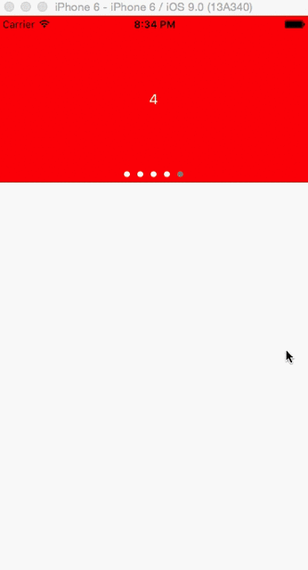

LJAutoScrollView
=================

LJAutoScrollView class provides an endlessly circulate scroll view. It allows auto scrolling infinitely in the horizontal direction.

- It offers an encapsulation of UICollectionView to support reuse features.

- Use NSTimer for auto scrolling.

- The implement of infinite scroll is inspired by this page:[Circular Infinite UIScrollView]



Comparison
-----------

Compared to other implmentation, LJAutoScrollView is more stable and easier to use:
- Some implementation like [GBInfiniteScrollView] is subclass from UIScrollView, while LJAutoScrollView uses UICollectionView, it's more stable on reuse feature and gesture recognization.

- LJAutoScrollView integrates UIPageControl as well. You need not to handle the page change yourself.

- The infinite circulate scroll feature implementation is more elegant and robust than [SDCycleScrollView].

- It's easier to use. The usage is described below.

Installation
----------
Grab the source file into your project.

Or use cocoapods. Here is an example of your podfile:

```objective-c
pod 'LJAutoScrollView'
```

Usage
------
- LJAutoScrollView is a subclass of UIView. Just take it as UIView when initialization.
```objective-c
self.autoScrollView = [[LJAutoScrollView alloc] initWithFrame:CGRectMake(0, 0, self.view.frame.size.width, kAutoScrollViewHeight)];

self.autoScrollView.delegate = self;
```

- Configure it as you like.

```objective-c
self.autoScrollView.itemSize = CGSizeMake(self.view.frame.size.width, kAutoScrollViewHeight);

self.autoScrollView.scrollInterval = 3.0f;
```

- Don't forget to implement the delegate methods.

Check the demo project for more details.

License
-----------
LJAutoScrollView is available under the MIT license. See the LICENSE file for more info.

Subscription
-------
欢迎关注[简书]，关注微信公众号(iOSers)，订阅高质量原创技术文章：


[Circular Infinite UIScrollView]:http://iosdevelopertips.com/user-interface/creating-circular-and-infinite-uiscrollviews.html
[GBInfiniteScrollView]:https://github.com/gblancogarcia/GBInfiniteScrollView
[SDCycleScrollView]:https://github.com/gsdios/SDCycleScrollView
[简书]:http://www.jianshu.com/users/25481f0294aa/latest_articles
